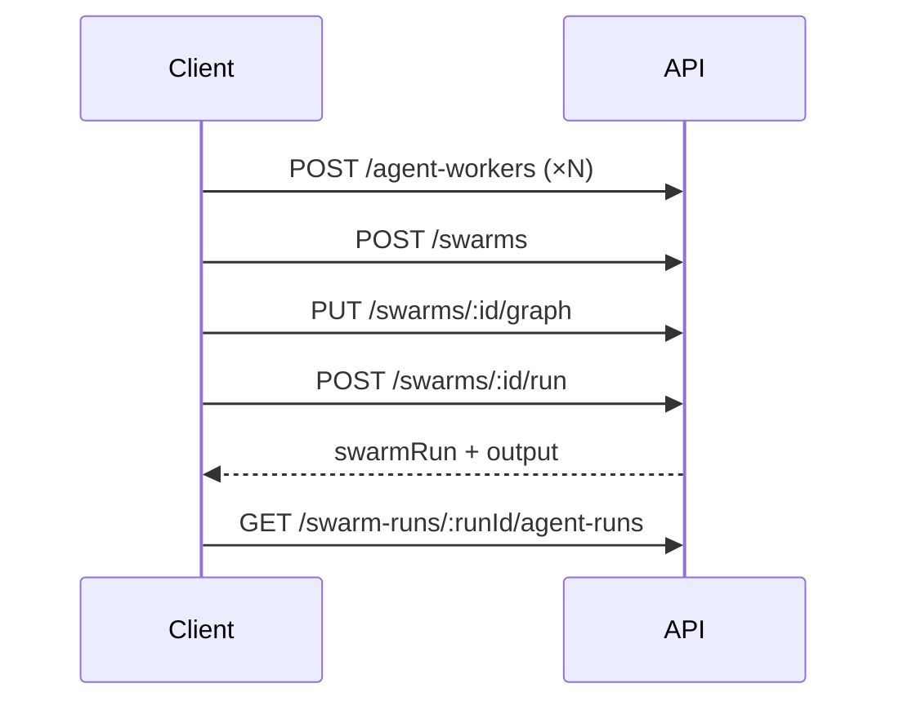

# Swarms HTTP API

REST API for multi-agent swarms. All routes require authentication unless noted.

**Base URL:** `{host}/api/v1` (default dev: `http://localhost:3001/api/v1`)

**Architecture guide:** [`SWARMS.md`](./SWARMS.md)

**Interactive editor (workspace UI):** [`SWARMS-WORKSPACE.md`](./SWARMS-WORKSPACE.md) — canvas, inspector, test panel, scope matrix.

---

## Authentication

User swarm routes use **`JwtOrUserPatGuard`** + **`UserPatScopeGuard`** + **`RolesGuard`** (role `user`). Admin routes (`/admin/*`) remain **session JWT only**.

### Session (browser / editor)

- **Header:** `Authorization: Bearer <access_token>`
- Obtain via `POST /auth/login` or `POST /auth/register`.

### Automation (scripts, agents)

- **Create PAT (once):** `POST /auth/api-tokens` with session JWT — response includes full `token` (store it; not shown again).
- **List / revoke:** `GET /auth/api-tokens`, `DELETE /auth/api-tokens/:id` — JWT only.
- **Header:** `Authorization: Bearer {AGENT_KEY_PREFIX}<tokenId>_<secret>` (default prefix `af_`; see `AGENT_KEY_PREFIX` in `.env`).

**PAT scope (deny-by-default):** user API tokens may only call handlers marked `@AllowUserPat()` — read + run automation, not graph edits or deletes. A PAT on a blocked route returns **`403 Forbidden`** (not `401`).

| PAT allowed | PAT blocked (JWT only) |
|-------------|-------------------------|
| `GET` swarms, graph, runs, workers, swarm-runs, approvals | `POST/PATCH/DELETE` swarms, `PUT` graph, worker CRUD |
| `POST /swarms/:id/run`, `.../run/stream` | `POST /swarms` (create) |
| `POST /agent-workers/:id/run` (+ stream) | Worker create / patch / delete |
| `GET` + `POST .../decide` on swarm-run-approvals | — |

**Ownership:** resources are scoped to the authenticated user (`sub` → `createdBy` / `triggeredBy`). Other users’ resources return `403 Forbidden`. Revoked or invalid PAT → `401`.

**Hired swarms:** users with an active `swarm_hiring` may run a platform swarm they do not own; runs are attributed to the token owner. Platform workflows: [`/processes/:key/run`](./PROCESSES.md) or [`/external/processes`](./PROCESSES.md#external-api-automation) with the same PAT. Usage analytics: [`METRICS.md`](./METRICS.md).

---

## Common responses

| Status | Meaning |
|--------|---------|
| `200` | Success (GET, PATCH, PUT) |
| `201` | Created (implicit on POST with body return) |
| `204` | Success, no body (DELETE) |
| `400` | Validation error (invalid DTO) |
| `401` | Missing or invalid JWT / PAT |
| `403` | Valid PAT on a session-only (non-automation) route |
| `403` | Not owner of resource |
| `404` | Resource not found |
| `500` | Server error (e.g. swarm run failed after starting) |

Validation errors follow NestJS `ValidationPipe` shape:

```json
{
  "statusCode": 400,
  "message": ["name must be longer than or equal to 1 characters"],
  "error": "Bad Request"
}
```

---

## Inference setup

### `GET /inference/setup`

Provider catalog and generation defaults for the swarm workspace (no secrets).

**Response `200`:** see [`INFERENCE.md`](./INFERENCE.md#setup-api-frontend).

---

## Agent workers

Reusable agent blueprints (`agent_workers` collection).

### `POST /agent-workers`

Create a worker.

**Body:**

```json
{
  "name": "analyzer",
  "model": {
    "provider": "openai",
    "name": "gpt-4o-mini",
    "contextWindow": 128000
  },
  "systemPrompt": "You analyze topics and return structured JSON.",
  "promptMessages": [],
  "inputSchema": {},
  "outputSchema": { "type": "object" },
  "compressOutput": false,
  "maxRetries": 3,
  "timeoutMs": 60000
}
```

| Field | Required | Type | Notes |
|-------|----------|------|-------|
| `name` | yes | string | |
| `model` | yes | object | `provider`, `name`, `contextWindow` (int ≥ 1), optional `params` (`temperature`, `maxTokens`, `jsonMode`, `model`) — see [`INFERENCE.md`](./INFERENCE.md) |
| `systemPrompt` | yes | string | Instructions (first `system` message) |
| `promptMessages` | no | array | `{ role: "system" \| "user", content: string }[]` — see [`SWARMS-AGENT-IO.md`](./SWARMS-AGENT-IO.md) |
| `inputSchema` | no | object | JSON Schema or contract (optional) |
| `outputSchema` | no | object | Expected output JSON shape — see [`SWARMS-AGENT-IO.md`](./SWARMS-AGENT-IO.md) |
| `openaiTools` | no | object | OpenAI Responses tools (`webSearch`, `functions`, …) — [`SWARMS-AGENT-IO.md`](./SWARMS-AGENT-IO.md) |
| `grokTools` | no | object | xAI Responses tools — [`SWARMS-AGENT-IO.md`](./SWARMS-AGENT-IO.md#grok-tools-x_search) |
| `agentTools` | no | string[] | Platform function tools (`webpage_scrape`, `run_swarm`) — [`TOOLS.md`](./TOOLS.md). `run_swarm` omitted at inference when `swarmTools` is non-empty. |
| `swarmTools` | no | string[] | Swarm ids exposed as `swarm_<objectId>` functions — [`TOOLS.md`](./TOOLS.md#swarm-tools-swarmtools) |
| `compressOutput` | no | boolean | default `false` (legacy upstream filter) |
| `upstreamFields` | no | string[] | Keys from upstream when `compressOutput` is true |
| `maxRetries` | no | number | default `3` |
| `timeoutMs` | no | number | default `60000` |

**Response `200`:** serialized worker (see [Agent worker object](#agent-worker-object)).

---

### `GET /agent-workers`

List workers owned by the current user (newest first).

**Response `200`:** array of [agent worker objects](#agent-worker-object).

---

### `GET /agent-workers/:id`

Get one worker by MongoDB id.

**Response `200`:** [agent worker object](#agent-worker-object).

---

### `PATCH /agent-workers/:id`

Partial update. All fields from create are optional.

**Response `200`:** updated [agent worker object](#agent-worker-object).

---

### `DELETE /agent-workers/:id`

Delete a worker.

**Response `204`:** empty body.

---

### `POST /agent-workers/:id/run`

Run **one worker** in isolation (workspace node preview). Does not traverse the graph.

**Body:**

```json
{
  "swarmId": "507f1f77bcf86cd799439011",
  "input": { "message": "Hello" },
  "upstream": []
}
```

| Field | Required | Notes |
|-------|----------|-------|
| `swarmId` | yes | Goal comes from this swarm; run is stored under it. |
| `input` | no | → `runInput` (any JSON object; `message` optional — [`SWARMS-AGENT-IO.md`](./SWARMS-AGENT-IO.md)). |
| `upstream` | no | Simulated predecessor outputs; default `[]`. |

**Response `200`:**

```json
{
  "swarmRun": { "runKind": "worker_preview", "...": "see swarm run object" },
  "output": { "...": "worker output" },
  "agentRunId": "507f1f77bcf86cd799439017"
}
```

See [`SWARMS-WORKSPACE.md`](./SWARMS-WORKSPACE.md) for when to use preview vs full swarm run.

### `POST /agent-workers/:id/run/stream`

SSE variant of worker preview. Same body and event schema as [`POST /swarms/:id/run/stream`](#post-swarmsidrunstream).

---

## Swarms

Swarm definitions (`swarms` collection).

### `POST /swarms`

**Body:**

```json
{
  "name": "Blog pipeline",
  "description": "Analyzer then writer",
  "goal": "Write a clear technical post about the user's topic",
  "topology": "pipeline",
  "workers": ["<agentWorkerId1>", "<agentWorkerId2>"],
  "version": "1.0.0",
  "isPublic": false
}
```

| Field | Required | Type | Notes |
|-------|----------|------|-------|
| `name` | yes | string | |
| `goal` | yes | string | Passed to every worker via context |
| `description` | no | string | |
| `topology` | no | enum | `pipeline` \| `parallel` \| `hybrid` (default `hybrid`) |
| `workers` | no | string[] | MongoDB ids of agent workers |
| `version` | no | string | default `1.0.0` |
| `isPublic` | no | boolean | default `false` |

**Response `200`:** [swarm object](#swarm-object).

---

### `GET /swarms`

List swarms owned by the current user.

**Response `200`:** array of [swarm objects](#swarm-object).

---

### `GET /swarms/:id`

**Response `200`:** [swarm object](#swarm-object).

---

### `GET /swarms/:id/workspace`

Single payload to bootstrap the swarm editor (swarm + graph + workers).

**Response `200`:**

```json
{
  "swarm": { "...": "swarm object" },
  "graph": { "...": "swarm graph object" } | null,
  "workers": [ "...": "agent worker objects" ],
  "referencedSwarms": [
    {
      "id": "674abc...",
      "name": "Child swarm",
      "goal": "...",
      "active": true,
      "platformRunnable": false,
      "canRun": true,
      "inputs": ["message"],
      "outputs": ["summary"]
    }
  ]
}
```

| Field | Notes |
|-------|--------|
| `graph` | `null` if no graph was saved yet. |
| `workers` | Workers referenced by the swarm/graph, **owned by the current user only**. |
| `referencedSwarms` | Metadata for swarms referenced by `kind: "swarm"` nodes in the graph (inputs/outputs + run access). Omitted or `[]` when none. |

Full UX guide: [`SWARMS-WORKSPACE.md`](./SWARMS-WORKSPACE.md).

---

### `PATCH /swarms/:id`

Partial update. Same fields as create, all optional.

**Response `200`:** [swarm object](#swarm-object).

---

### `DELETE /swarms/:id`

**Response `204`:** empty body.

---

## Swarm graph

One graph per swarm (`swarm_graphs`). Defines how workers connect.

### `GET /swarms/:id/graph`

**Response `200`:** [swarm graph object](#swarm-graph-object).

**Response `404`:** graph not created yet.

---

### `PUT /swarms/:id/graph`

Create or replace the graph for a swarm (upsert).

**Body:**

```json
{
  "nodes": [
    {
      "workerId": "<agentWorkerId>",
      "type": "worker",
      "positionX": 0,
      "positionY": 0
    }
  ],
  "edges": [
    {
      "from": "<agentWorkerIdA>",
      "to": "<agentWorkerIdB>",
      "type": "sequential",
      "condition": null
    }
  ],
  "entryNode": "<agentWorkerIdA>",
  "exitNode": "<agentWorkerIdB>"
}
```

| Field | Required | Notes |
|-------|----------|-------|
| `nodes` | yes | Min length 1 |
| `nodes[].id` | no | Stable graph node id (required for control nodes) |
| `nodes[].kind` | no | `worker` \| `ifelse` \| `while` \| `scraper` \| `swarm` \| `user_approval` \| `end` (+ Start via `data.controlKind`) |
| `nodes[].workerId` | for workers | MongoDB id |
| `nodes[].type` | no | Legacy alias (`worker`, `ifelse`, `scraper`, …) |
| `nodes[].data` | no | Control payload (sub-swarm `swarmId`, if/else `cases`, …) |
| `edges[].sourceHandle` | for branch nodes | `loop` \| `done` \| `success` \| `failed` \| `approve` \| `reject` \| `case-<id>` \| `else` |
| `edges` | yes | Can be empty array |
| `edges[].type` | no | `sequential` \| `parallel` \| `conditional` |
| `edges[].condition` | no | For conditional edges |
| `entryNode` | yes | Worker id where execution starts |
| `exitNode` | yes | Worker id whose output ends the swarm run |

**Response `200`:** [swarm graph object](#swarm-graph-object).

**Sub-swarm validation (`400`):** When the graph contains `kind: "swarm"` nodes, the service checks child `swarmId`, access (owner \| hiring \| `platformRunnable`), acyclic references, max nesting depth **3**, and that referenced swarms have no `user_approval` nodes. See [`SWARMS.md` — Sub-swarm](./SWARMS.md#sub-swarm-control-nodes).

---

## Swarm execution

### `POST /swarms/:id/run`

Run the swarm graph. Requires a graph (`PUT /swarms/:id/graph`) and workers in the database.

**Body:**

```json
{
  "input": {
    "topic": "NestJS multi-agent systems"
  },
  "maxNodeVisits": 50
}
```

| Field | Required | Notes |
|-------|----------|-------|
| `input` | no | Initial payload → `SwarmContext.runInput` |
| `maxNodeVisits` | no | Loop guard (default `50`) |

**Response `200`:**

```json
{
  "swarmRun": { "...": "see swarm run object" },
  "output": { "...": "exit node worker output" },
  "paused": false
}
```

When the graph hits a **user approval** node, the run pauses instead of failing:

```json
{
  "swarmRun": { "status": "awaiting_approval", "pendingApprovalId": "...", "hasCheckpoint": true },
  "output": null,
  "paused": true,
  "approval": { "id": "...", "message": "...", "assigneeUserId": "..." }
}
```

Resume via `POST /swarm-run-approvals/:id/decide`. See [`SWARMS.md` — User approval](./SWARMS.md#user-approval-control-nodes).

On failure after the run starts, `swarmRun.status` is `failed` and the API may return `500` with the error message. Check `GET /swarm-runs/:id` for details.

**Inference:** With `INFERENCE_MODE=llm` or `auto` + configured provider keys, workers call real models. See [`INFERENCE.md`](./INFERENCE.md). Otherwise responses may include `stub: true`.

---

### `POST /swarms/:id/run/stream`

Same body as `POST /swarms/:id/run`. Returns **`text/event-stream`** (SSE) for the workspace test panel.

Events: `swarm_start`, `node_start`, `node_done`, `node_skipped`, `worker_start`, `worker_meta`, `delta`, `worker_done`, `approval_required`, `swarm_done`, `error`.

Contract: [`INFERENCE.md` — SSE](./INFERENCE.md#sse-swarm-run-stream).

---

### `GET /swarms/:id/runs`

List execution history for a swarm (newest first).

**Response `200`:** array of [swarm run objects](#swarm-run-object).

---

## Swarm runs

Individual swarm executions (`swarm_runs`).

### `GET /swarm-runs/:id`

Get one run. Only the user who triggered it (`triggeredBy`) can access.

**Response `200`:** [swarm run object](#swarm-run-object).

---

### `GET /swarm-runs/:id/pending-approval`

Pending human gate for a paused run (`status: awaiting_approval`), or `null`.

**Response `200`:** approval object or `null`.

---

### `GET /swarm-runs/:id/agent-runs`

List all worker executions for a swarm run (`agent_runs`), ordered by creation time.

**Response `200`:** array of [agent run objects](#agent-run-object).

---

## Swarm run approvals

Human gates created when a run hits a `user_approval` graph node. Collection: `swarm_run_approvals`.

### `GET /swarm-run-approvals/pending`

Inbox for the current user (assignee). Newest first.

**Response `200`:** array of approval objects.

---

### `GET /swarm-run-approvals/:id`

Detail for assignee or original requester (`requestedBy`).

---

### `POST /swarm-run-approvals/:id/decide`

```json
{
  "decision": "approve",
  "comment": "Looks good"
}
```

| Field | Required | Notes |
|-------|----------|-------|
| `decision` | yes | `approve` or `reject` |
| `comment` | no | Stored on approval + node output |

**Response `200`:** `{ approval, swarmRun, output, paused }` — if another approval node is hit, `paused: true` again.

---

## Response shapes

### Agent worker object

```json
{
  "id": "507f1f77bcf86cd799439011",
  "name": "analyzer",
  "model": {
    "provider": "openai",
    "name": "gpt-4o-mini",
    "contextWindow": 128000
  },
  "systemPrompt": "...",
  "promptMessages": [
    { "role": "user", "content": "{{runInput.message}}" }
  ],
  "upstreamFields": [],
  "inputSchema": {},
  "outputSchema": {},
  "openaiTools": {},
  "grokTools": {},
  "agentTools": [],
  "swarmTools": [],
  "compressOutput": false,
  "maxRetries": 3,
  "timeoutMs": 60000,
  "createdBy": "507f1f77bcf86cd799439012",
  "createdAt": "2026-05-27T12:00:00.000Z",
  "updatedAt": "2026-05-27T12:00:00.000Z"
}
```

### Swarm object

```json
{
  "id": "507f1f77bcf86cd799439011",
  "name": "Blog pipeline",
  "description": "",
  "goal": "Write a clear technical post...",
  "topology": "pipeline",
  "workers": ["507f1f77bcf86cd799439013"],
  "createdBy": "507f1f77bcf86cd799439012",
  "version": "1.0.0",
  "isPublic": false,
  "active": true,
  "platformRunnable": false,
  "triggers": [],
  "createdAt": "2026-05-27T12:00:00.000Z",
  "updatedAt": "2026-05-27T12:00:00.000Z"
}
```

| Field | Notes |
|-------|--------|
| `active` | When `false`, run endpoints return `403`. |
| `platformRunnable` | When `true`, any authenticated user may run/reference without hiring. Writable only via **`PATCH /admin/swarms/:id`** (ignored on user `PATCH /swarms/:id`). |

### Swarm graph object

```json
{
  "id": "507f1f77bcf86cd799439014",
  "swarmId": "507f1f77bcf86cd799439011",
  "nodes": [
    {
      "id": "agent-1716998400123",
      "kind": "worker",
      "workerId": "507f1f77bcf86cd799439013",
      "type": "worker",
      "position": { "x": 0, "y": 0 },
      "data": {}
    },
    {
      "id": "swarm-node-child",
      "kind": "swarm",
      "position": { "x": 200, "y": 0 },
      "data": {
        "swarmId": "507f1f77bcf86cd799439099",
        "inputFields": [{ "key": "message", "source": "upstream", "valuePath": "output.topic" }]
      }
    }
  ],
  "edges": [
    {
      "from": "507f1f77bcf86cd799439013",
      "to": "507f1f77bcf86cd799439015",
      "type": "sequential",
      "condition": null
    }
  ],
  "entryNode": "507f1f77bcf86cd799439013",
  "exitNode": "507f1f77bcf86cd799439015",
  "createdAt": "2026-05-27T12:00:00.000Z",
  "updatedAt": "2026-05-27T12:00:00.000Z"
}
```

### Swarm run object

```json
{
  "id": "507f1f77bcf86cd799439016",
  "swarmId": "507f1f77bcf86cd799439011",
  "triggeredBy": "507f1f77bcf86cd799439012",
  "runKind": "swarm",
  "parentSwarmRunId": null,
  "parentNodeId": null,
  "depth": 0,
  "input": { "message": "NestJS" },
  "output": { "stub": true },
  "agentRuns": ["507f1f77bcf86cd799439017"],
  "status": "done",
  "durationMs": 42,
  "promptTokens": 1200,
  "completionTokens": 340,
  "totalTokens": 1540,
  "costUsd": 0.000384,
  "scrapeCostUsd": 0.000063,
  "totalCostUsd": 0.000447,
  "usageByModel": [
    {
      "provider": "openai_direct",
      "model": "gpt-4o-mini",
      "promptTokens": 900,
      "completionTokens": 280,
      "totalTokens": 1180,
      "costUsd": 0.000303,
      "agentRunCount": 2
    },
    {
      "provider": "openai_direct",
      "model": "gpt-4o",
      "promptTokens": 300,
      "completionTokens": 60,
      "totalTokens": 360,
      "costUsd": 0.000081,
      "agentRunCount": 1
    }
  ],
  "scrapeUsage": {
    "requestCount": 1,
    "browserDurationMs": 2500,
    "costUsd": 0.000063,
    "requests": [
      {
        "scrapeRequestId": "507f1f77bcf86cd799439018",
        "url": "https://example.com",
        "latencyMs": 2500,
        "costUsd": 0.000063,
        "status": "completed"
      }
    ]
  },
  "failureReason": "",
  "createdAt": "2026-05-27T12:00:00.000Z",
  "updatedAt": "2026-05-27T12:00:00.000Z"
}
```

`status`: `idle` | `running` | `failed` | `done`

`runKind`: `swarm` (full graph run) | `worker_preview` (single-worker test) | `sub_swarm` (nested run from a sub-swarm node). When `sub_swarm`, `parentSwarmRunId`, `parentNodeId`, and `depth` are set.

### Agent run object

```json
{
  "id": "507f1f77bcf86cd799439017",
  "workerId": "507f1f77bcf86cd799439013",
  "swarmRunId": "507f1f77bcf86cd799439016",
  "messages": [],
  "input": {
    "goal": "...",
    "systemPrompt": "...",
    "upstream": [],
    "shared": {},
    "runInput": { "topic": "NestJS" }
  },
  "output": { "summary": "...", "intent": "..." },
  "inference": {
    "request": { "model": "gpt-4o-mini", "messages": [] },
    "response": { "text": "...", "usage": {} }
  },
  "status": "done",
  "durationMs": 10,
  "attempt": 0,
  "createdAt": "2026-05-27T12:00:00.000Z",
  "updatedAt": "2026-05-27T12:00:00.000Z"
}
```

Field semantics: [`SWARMS-AGENT-IO.md`](./SWARMS-AGENT-IO.md#persisted-agent_runs-audit-vs-business).

---

## Typical workflow



1. Create one or more **agent workers**.
2. Create a **swarm** with `goal` and optional `workers` list.
3. **Upsert the graph** (`entryNode`, `exitNode`, `edges`).
4. **Run** with optional `input`.
5. Inspect **swarm run** and **agent runs** for audit/debug.

---

## cURL examples

Replace `TOKEN` and ids with real values.

```bash
# Create worker
curl -s -X POST http://localhost:3001/api/v1/agent-workers \
  -H "Authorization: Bearer TOKEN" \
  -H "Content-Type: application/json" \
  -d '{
    "name": "analyzer",
    "model": { "provider": "openai", "name": "gpt-4o-mini", "contextWindow": 128000 },
    "systemPrompt": "Analyze the topic and return JSON with result and confidence."
  }'

# Create swarm
curl -s -X POST http://localhost:3001/api/v1/swarms \
  -H "Authorization: Bearer TOKEN" \
  -H "Content-Type: application/json" \
  -d '{
    "name": "Demo pipeline",
    "goal": "Process the user topic",
    "topology": "pipeline"
  }'

# Upsert graph (use real worker ids)
curl -s -X PUT http://localhost:3001/api/v1/swarms/SWARM_ID/graph \
  -H "Authorization: Bearer TOKEN" \
  -H "Content-Type: application/json" \
  -d '{
    "nodes": [{ "workerId": "WORKER_A" }],
    "edges": [],
    "entryNode": "WORKER_A",
    "exitNode": "WORKER_A"
  }'

# Run
curl -s -X POST http://localhost:3001/api/v1/swarms/SWARM_ID/run \
  -H "Authorization: Bearer TOKEN" \
  -H "Content-Type: application/json" \
  -d '{ "input": { "topic": "hello" } }'
```

---

## Route summary

| Method | Path | Description |
|--------|------|-------------|
| `POST` | `/agent-workers` | Create worker |
| `GET` | `/agent-workers` | List my workers |
| `GET` | `/agent-workers/:id` | Get worker |
| `PATCH` | `/agent-workers/:id` | Update worker |
| `DELETE` | `/agent-workers/:id` | Delete worker |
| `POST` | `/agent-workers/:id/run` | Preview one worker |
| `POST` | `/agent-workers/:id/run/stream` | Preview one worker (SSE) |
| `POST` | `/swarms` | Create swarm |
| `POST` | `/swarms/:id/run/stream` | Run swarm (SSE) |
| `GET` | `/swarms/:id/workspace` | Editor bootstrap bundle |
| `GET` | `/swarms` | List my swarms |
| `GET` | `/swarms/:id` | Get swarm |
| `PATCH` | `/swarms/:id` | Update swarm |
| `DELETE` | `/swarms/:id` | Delete swarm |
| `GET` | `/swarms/:id/graph` | Get graph |
| `PUT` | `/swarms/:id/graph` | Upsert graph |
| `POST` | `/swarms/:id/run` | Execute swarm |
| `GET` | `/swarms/:id/runs` | List runs for swarm |
| `GET` | `/swarm-runs/:id` | Get swarm run |
| `GET` | `/swarm-runs/:id/agent-runs` | List agent runs for a swarm run |

### Tools (agent functions & integrations)

See [`TOOLS.md`](./TOOLS.md).

| Method | Path | Description |
|--------|------|-------------|
| `GET` | `/tools` | Agent tool catalog |
| `POST` | `/tools/:id/run` | Run tool (`webpage_scrape`, `run_swarm`, …) |
| `POST` | `/tools/webpage-scrape/run` | Scrape URL |
| `GET` | `/tools/catalog?companyId=` | Platform integrations for prompts |
| `GET` | `/tools/integrations` | Integrations + connection status |
| `POST` | `/tools/integrations/:platformToolKey/connect` | Connect integration |
| `DELETE` | `/tools/integrations/:platformToolKey/connect` | Disconnect |

---

## Admin (role `admin`)

Requires **`JwtAuthGuard`** + **`RolesGuard`** + **`@Roles(UserRole.ADMIN)`**. Cross-tenant: no ownership check on `createdBy`.

### `GET /admin/agent-workers`

Paginated list of all agent workers.

**Query:** `page` (default `1`), `limit` (default `20`, max `100`), optional `search` (name), optional `userId` (filter by `createdBy`).

**Response `200`:**

```json
{
  "items": [/* agent worker objects */],
  "total": 42,
  "page": 1,
  "limit": 20
}
```

### `GET /admin/agent-workers/:id`

Get any worker by id.

### `PATCH /admin/agent-workers/:id`

Partial update (same body fields as user `PATCH /agent-workers/:id`).

### `DELETE /admin/agent-workers/:id`

Delete any worker (`204`).

---

### `GET /admin/swarms`

Paginated list of all swarms.

**Query:** `page`, `limit`, optional `search` (name, description, goal), optional `userId` (filter by `createdBy`).

**Response `200`:** `{ items, total, page, limit }` with [swarm objects](#swarm-object).

### `GET /admin/swarms/:id`

Get any swarm by id.

### `PATCH /admin/swarms/:id`

Partial update (same body as user `PATCH /swarms/:id`), plus admin-only fields:

| Field | Notes |
|-------|--------|
| `platformRunnable` | `boolean` — allow any authenticated user to run/reference without hiring |

User `PATCH /swarms/:id` **ignores** `platformRunnable`.

### `DELETE /admin/swarms/:id`

Delete any swarm (`204`).

### `GET /admin/swarms/:id/graph`

Get graph for any swarm (404 if graph never created).

### `PUT /admin/swarms/:id/graph`

Upsert graph (same body as user `PUT /swarms/:id/graph`).

---

### Admin route summary

| Method | Path | Action |
|--------|------|--------|
| `GET` | `/admin/agent-workers` | List all workers |
| `GET` | `/admin/agent-workers/:id` | Get worker |
| `PATCH` | `/admin/agent-workers/:id` | Update worker |
| `DELETE` | `/admin/agent-workers/:id` | Delete worker |
| `GET` | `/admin/swarms` | List all swarms |
| `GET` | `/admin/swarms/:id` | Get swarm |
| `PATCH` | `/admin/swarms/:id` | Update swarm |
| `DELETE` | `/admin/swarms/:id` | Delete swarm |
| `GET` | `/admin/swarms/:id/graph` | Get graph |
| `PUT` | `/admin/swarms/:id/graph` | Upsert graph |
