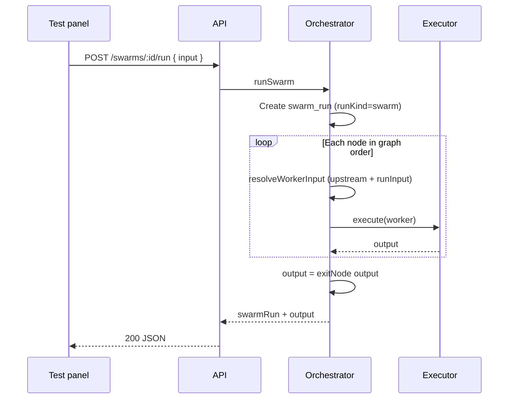

# Swarm workspace — frontend guide

This document is the **product + API contract** for the interactive swarm editor in **agentatlas-platform** (or any client). It explains what the backend supports today, how the pieces fit together, and what is explicitly **out of scope**.

**Related docs:**

| Doc | Purpose |
|-----|---------|
| [`SWARMS.md`](./SWARMS.md) | Data model, orchestrator algorithm, `SwarmContext` |
| [`SWARMS-API.md`](./SWARMS-API.md) | Full HTTP reference (all endpoints) |
| [`TOOLS.md`](./TOOLS.md) | Agent tools, swarm tools, Connected tools prompt block |
| [`GUARDS.md`](./GUARDS.md) | Auth and `@Roles` |

**Base URL:** `{host}/api/v1` · **Auth:** `Authorization: Bearer <access_token>` · **Role:** `user` (admins may call user routes too).

---

## 1. What you are building

The **swarm workspace** is a single-screen experience with three regions:

```text
┌─────────────────────────────────────────────────────────────┬──────────────────┐
│  Canvas (graph)                                              │  Test panel      │
│  - Nodes = AgentWorkers + control nodes (Start, If/else,     │  (fixed right)   │
│    While, Scraper, Sub-swarm, User approval, End)            │                  │
│  - Edges = flow (sequential / parallel / conditional)        │                  │
│  - Drag → save positions via PUT graph                       │  User message    │
│  - Click node → open inspector                               │  → POST run      │
│                                                              │  → show output   │
├─────────────────────────────────────────────────────────────┤                  │
│  Inspector (drawer / side panel on node click)               │                  │
│  - Edit worker fields (PATCH agent-workers/:id)              │                  │
│  - Optional: POST agent-workers/:id/run (preview one node)   │                  │
└─────────────────────────────────────────────────────────────┴──────────────────┘
```

| UI zone | User action | Backend |
|---------|-------------|---------|
| **Load editor** | Open swarm `abc` | `GET /swarms/:id/workspace` (recommended) or parallel GETs |
| **Canvas** | Move node | Debounced `PUT /swarms/:id/graph` |
| **Canvas** | Connect nodes | `PUT /swarms/:id/graph` (full graph body) |
| **Palette** | Place **Sub-swarm** control node | Local React Flow node → save via `PUT …/graph` |
| **Inspector** | Configure sub-swarm (child id, inputs) | Node `data` on graph; see [Sub-swarm node](#sub-swarm-node-platform-editor) |
| **Inspector** | Save worker config | `PATCH /agent-workers/:workerId` |
| **Inspector** | “Test this node” | `POST /agent-workers/:workerId/run` |
| **Test panel** | “Run full swarm” (streaming) | `POST /swarms/:id/run/stream` (SSE) |
| **Test panel** | “Run full swarm” (sync) | `POST /swarms/:id/run` |
| **Debug** | See steps | `GET /swarm-runs/:runId/agent-runs` |

---

## 2. Recommended bootstrap: workspace bundle

### `GET /swarms/:id/workspace`

Returns everything needed to render the canvas + inspectors in **one round trip**:

```json
{
  "swarm": { "id", "name", "goal", "topology", "workers", "platformRunnable", "active", ... },
  "graph": { "nodes", "edges", "entryNode", "exitNode", ... } | null,
  "workers": [ /* serialized agent workers owned by the user */ ],
  "referencedSwarms": [
    {
      "id": "674abc...",
      "name": "Company research",
      "goal": "...",
      "active": true,
      "platformRunnable": true,
      "canRun": true,
      "inputs": ["message"],
      "outputs": ["summary", "sources"]
    }
  ]
}
```

| Field | Notes |
|-------|--------|
| `graph` | `null` if the user never saved a graph (`PUT .../graph`). Canvas should show empty state + CTA to add nodes. |
| `workers` | Union of `swarm.workers`, all `graph.nodes[].workerId`, `entryNode`, `exitNode`. **Only workers owned by the current user** are returned (foreign ids are dropped). |
| `referencedSwarms` | One row per child swarm id referenced by `kind: "swarm"` nodes in the saved graph. Includes Start input names and End output keys for the config panel. Empty when the graph has no sub-swarm nodes. Use with `listSwarms()` to populate the picker for swarms not yet on the canvas. |

**Alternative (3 requests):** `GET /swarms/:id` + `GET /swarms/:id/graph` (handle 404) + `GET /agent-workers` filtered client-side by ids.

---

## 3. Canvas data model

### Nodes

**Worker nodes** reference an **AgentWorker** by MongoDB id:

```json
{
  "id": "agent-1716998400123",
  "kind": "worker",
  "workerId": "674abc...",
  "type": "worker",
  "position": { "x": 120, "y": 80 },
  "data": { "label": "Researcher" }
}
```

**Control nodes** use `kind` and `data` (no `workerId`): `start`, `ifelse`, `while`, `scraper`, `swarm`, `user_approval`, `end`. See [`SWARMS.md`](./SWARMS.md) for runtime behavior.

- `id` is a frontend-stable React Flow node id (required for control nodes; defaults to `workerId` on worker writes when omitted).
- `position.{x,y}` is for the UI only; the orchestrator ignores it.
- Worker `data` is UI metadata (label overrides). Control `data` is orchestrator payload (if/else cases, scraper URL, sub-swarm `swarmId`, …).
- `entryNode` / `exitNode` are **graph node ids** (Start node id, End node id, or worker id when no Start/End).

### Sub-swarm node (platform editor)

Palette label: **Sub-swarm** (`kind: "swarm"`, React Flow type `swarm`).

| UI | Persisted field |
|----|-----------------|
| Swarm picker | `data.swarmId` |
| Optional label | `data.label` |
| Pass shared state | `data.passShared` |
| Input mapping rows | `data.inputFields[]` — `{ id?, key, source, valuePath?, staticValue? }` |
| Success / Failed wires | `edges[].sourceHandle` = `success` \| `failed` |

**Picker data:** On editor load, merge `GET /swarms/:id/workspace` → `referencedSwarms` with `GET /swarms` (or admin list). Exclude the **current** swarm id (no self-reference). Show `platformRunnable` and `canRun` hints when the user cannot run the child without hiring.

**Empty `inputFields`:** upstream output is passed through to the child run (backend default). Add rows to map each child Start input explicitly.

**Save validation:** Graph `PUT` returns `400` for missing `swarmId`, self-reference, cycles, depth &gt; 3, inaccessible child swarms, or child graphs containing `user_approval`. Full rules: [`SWARMS.md` — Sub-swarm](./SWARMS.md#sub-swarm-control-nodes).

**Example persisted node:**

```json
{
  "id": "swarm-node-research",
  "kind": "swarm",
  "position": { "x": 400, "y": 200 },
  "data": {
    "label": "Company research",
    "swarmId": "674abc1234567890abcdef01",
    "passShared": false,
    "inputFields": [
      { "key": "message", "source": "upstream", "valuePath": "output.topic" }
    ]
  }
}
```

### While node (platform editor)

Palette label: **While** (`kind: "while"`, React Flow type `while`).

| UI | Persisted field |
|----|-----------------|
| Condition (Simple / Code) | `data.condition` |
| Code mode flag | `data.useCode` (editor only) |
| Max iterations | `data.maxIterations` (default 50) |
| Loop / Done wires | `edges[].sourceHandle` = `loop` \| `done` |

**Canvas:** target on the left; **Loop** and **Done** source handles on the right (top / bottom). Connect the loop body from **Loop** and wire the last body node back to the While **target**. Connect **Done** to the path that runs when the condition becomes false.

**Config panel:** `agentatlas-platform` → `src/components/admin/swarms/editor/nodes/while/` — reuses if/else expression helpers (`buildIfElseConditionFieldOptions`, `InstructionsEditor` in Code mode).

**Save:** `canvasSnapshotToApiPayload` persists `kind: "while"`. Branch edges require `sourceHandle` (`validateBranchEdgeHandles`).

Runtime: [`SWARMS.md` — While control nodes](./SWARMS.md#while-control-nodes).

**Example persisted node:**

```json
{
  "id": "while-retry",
  "kind": "while",
  "position": { "x": 320, "y": 160 },
  "data": {
    "condition": "runInput.attempts < 3",
    "maxIterations": 50
  }
}
```

**Example loop wiring:**

```json
[
  { "from": "agent-a", "to": "while-retry", "type": "sequential", "condition": null },
  { "from": "while-retry", "to": "agent-b", "type": "sequential", "condition": null, "sourceHandle": "loop" },
  { "from": "agent-b", "to": "while-retry", "type": "sequential", "condition": null },
  { "from": "while-retry", "to": "end-1", "type": "sequential", "condition": null, "sourceHandle": "done" }
]
```

### Edges

```json
{
  "from": "<graphNodeId>",
  "to": "<graphNodeId>",
  "type": "sequential" | "parallel" | "conditional",
  "condition": null | "always" | "output.<field>",
  "sourceHandle": null | "success" | "failed" | "approve" | "reject" | "case-<id>" | "else"
}
```

| Edge type | Runtime behavior |
|-----------|------------------|
| `sequential` | Data/control flow to `to`; with multiple incoming edges, `to` waits for **all** predecessors (join). |
| `parallel` | Same as `sequential` today; multiple branches from one parent run in the same wave once the parent finishes. |
| `conditional` | `to` runs only if `evaluateCondition(condition, output)` is true on the `from` output; otherwise `to` is skipped. |

**Condition language (today):** `always`, `output.<key>` (truthy check on output field), or bare key on output object. No full expression engine yet.

### Saving the graph

Always send the **full graph** on `PUT /swarms/:id/graph`:

```json
{
  "nodes": [ ... ],
  "edges": [ ... ],
  "entryNode": "<workerId>",
  "exitNode": "<workerId>"
}
```

**Frontend tips:**

- Debounce layout saves (300–800 ms) while dragging.
- Keep a local draft; show “Saving…” / “Saved” from PUT result.
- Validate: every edge `from`/`to` exists in `nodes`; `entryNode` / `exitNode` are in the graph.

---

## 4. Inspector (configure one worker)

### Read / write

| Action | Endpoint |
|--------|----------|
| Load | `GET /agent-workers/:id` (or from workspace `workers[]`) |
| Save | `PATCH /agent-workers/:id` |

Editable fields: `name`, `model`, `systemPrompt`, `promptMessages`, `inputSchema`, `outputSchema`, `compressOutput`, `upstreamFields`, `maxRetries`, `timeoutMs`.  
I/O contracts: [`SWARMS-AGENT-IO.md`](./SWARMS-AGENT-IO.md).

### Inspector sections (implemented in platform)

| UI section | API field | Role |
|------------|-----------|------|
| **Instructions** | `systemPrompt` | Always the first `system` message sent to the model. |
| **Messages** | `promptMessages[]` | Optional extra `{ role: "system" \| "user", content }` entries after Instructions. Use for extra system rules or a dedicated `user` payload (e.g. `{{runInput.message}}` for Responses `input`). |
| **Add Local Context** | — (inserts into active editor) | Inserts `{{goal}}`, `{{runInput.*}}`, `{{shared.*}}`, upstream tokens. No enable flags — add only the tokens you need. |
| **Add Global Context** | — | Optional `{{runInput.*}}` tokens when the caller enriches run input. |
| **Tools** | `openaiTools`, `agentTools`, `swarmTools` | OpenAI Direct only. Hosted web search + platform tools (`webpage_scrape`, …) + **Sub-swarms** picker. See [`TOOLS.md`](./TOOLS.md#workspace-ui) and **`agentatlas-platform/docs/SWARMS-TOOLS.md`**. |

**Runtime order:** Instructions (+ auto **Connected tools** block when functions are configured) → `promptMessages` only. Goal, run input, shared, and upstream are **not** auto-injected — use `{{…}}` tokens or explicit message bodies.

### Create worker from canvas

1. `POST /agent-workers` → new id  
2. Add node to local graph with `workerId`  
3. `PUT /swarms/:id/graph`  
4. Optionally `PATCH /swarms/:id` to append id to `workers[]`

---

## 5. Test panel (right sidebar)

### 5.1 Run input (`input` on run)

`input` is an **optional free-form JSON object** → `SwarmContext.runInput`. There is **no required `message` field**.

**Common patterns:**

```json
{ "input": { "message": "Analyze Q4 churn for SaaS SMBs" } }
```

```json
{ "input": { "summary": "User wants churn analysis for SaaS SMBs." } }
```

- Use `message` when the worker needs raw user text.
- Use `summary` (or other keys) when the run is already preprocessed or only structured context is needed.
- Configure each worker’s expected keys via `outputSchema` / planned `inputPick` — see [`SWARMS-AGENT-IO.md`](./SWARMS-AGENT-IO.md).
- Optional extra keys: `locale`, `sessionId`, `metadata`, etc.

### 5.2 Full swarm test (streaming — recommended)

**`POST /swarms/:id/run/stream`**

Same body as below. Response is **SSE** (`text/event-stream`). Events include `node_start` / `node_done` / `node_skipped` (canvas loaders), plus `worker_*` / `delta` for inference streaming. See [`INFERENCE.md` — SSE](./INFERENCE.md#sse-swarm-run-stream).

### 5.3 Full swarm test (blocking)

**`POST /swarms/:id/run`**

```json
{
  "input": { "message": "..." },
  "maxNodeVisits": 50
}
```

**Response `200`:**

```json
{
  "swarmRun": {
    "id": "...",
    "runKind": "swarm",
    "status": "done",
    "input": { "message": "..." },
    "output": { ... },
    ...
  },
  "output": { ... }
}
```

| Field | Meaning |
|-------|---------|
| `output` (top-level) | Final result = **exit node** worker output after full traversal. |
| `swarmRun` | Persisted run record; use `id` for debug endpoints. |

**Prerequisites:** Graph must exist; `entryNode` → … → `exitNode` must be valid; all referenced workers must exist.

**Errors:** Missing graph → `404`. Loop → `500` with loop message. Worker failure → `swarmRun.status === 'failed'`.

Use when you do not need live tokens. For the chat-like panel, prefer **`/run/stream`**.

### 5.4 Single-worker preview (inspector)

**`POST /agent-workers/:workerId/run`**

```json
{
  "swarmId": "<current swarm id>",
  "input": { "message": "..." },
  "upstream": []
}
```

| Field | Required | Notes |
|-------|----------|-------|
| `swarmId` | yes | Supplies `goal` from swarm; ties run to swarm history. |
| `input` | no | Same as full run (`runInput`). |
| `upstream` | no | Simulated predecessor outputs. Default `[]`. Use to test mid-pipeline without running the whole graph. |

**Response `200`:**

```json
{
  "swarmRun": { "runKind": "worker_preview", ... },
  "output": { ... },
  "agentRunId": "..."
}
```

| `runKind` | Use in UI |
|-----------|-----------|
| `swarm` | Full test panel runs |
| `worker_preview` | Per-node “Test worker” — filter in history if needed |

Streaming preview: **`POST /agent-workers/:id/run/stream`** (same body, same SSE events).

### 5.5 Debug timeline (optional UI)

After any run:

1. `GET /swarm-runs/:swarmRunId`  
2. `GET /swarm-runs/:swarmRunId/agent-runs` — ordered steps, each with `input`, `output`, `status`, `durationMs`

Use this for a collapsible “Execution steps” section under the test panel.

---

## 6. Execution semantics (what the user sees)

High-level flow for **`POST /swarms/:id/run`**:



**`upstream` in worker input:** Array of outputs from nodes with an edge **into** this worker. Filtering/compression: [`SWARMS-AGENT-IO.md`](./SWARMS-AGENT-IO.md) (`compressOutput` today; `inputPick` planned).

**Inference:** With `INFERENCE_MODE=auto|llm` and provider API keys, workers call real models. See [`INFERENCE.md`](./INFERENCE.md). Without keys (`auto`) or with `INFERENCE_MODE=stub`, output is stub-shaped:

```json
{ "workerId": "...", "stub": true, "upstreamCount": 1, "goal": "..." }
```

LLM output includes parsed `result` / JSON and `_inference` metadata; inspect `GET /swarm-runs/:id/agent-runs` for `messages[]`.

---

## 7. Frontend state checklist

| State | Source |
|-------|--------|
| `swarmId` | Route param |
| `swarm` | Workspace or GET swarm |
| `graph` | Workspace or GET graph (nullable) |
| `workersById` | `Map(id → worker)` from workspace |
| `pickerSwarms` | `listSwarms()` merged with `referencedSwarms`, minus current swarm |
| `selectedWorkerId` | Canvas selection |
| `inspectorDraft` | Local copy until PATCH |
| `testInput` | Panel textarea → `input.message` |
| `lastRun` | `swarmRun` + `output` from POST run |
| `isRunning` | Disable panel while POST in flight |

---

## 8. Scope matrix

### In scope (supported now)

| Capability | API |
|------------|-----|
| Load editor bundle | `GET /swarms/:id/workspace` |
| CRUD workers | `/agent-workers` |
| CRUD swarm metadata | `/swarms` |
| Save graph layout + topology | `PUT /swarms/:id/graph` |
| Full swarm test + final output | `POST /swarms/:id/run` |
| Single worker preview | `POST /agent-workers/:id/run` |
| Run history | `GET /swarms/:id/runs` |
| Per-step debug | `GET /swarm-runs/:id/agent-runs` |
| Run kind filtering | `swarmRun.runKind`: `swarm` \| `worker_preview` \| `sub_swarm` |
| Sub-swarm control node | Palette + inspector; `kind: "swarm"` on graph |
| `referencedSwarms` on workspace load | Child swarm inputs/outputs for inspector |
| Worker **Tools** + **Sub-swarms** | `agentTools`, `swarmTools`, `openaiTools` — [`TOOLS.md`](./TOOLS.md#workspace-ui), **`agentatlas-platform/docs/SWARMS-TOOLS.md`** |
| `platformRunnable` (admin) | `PATCH /admin/swarms/:id` `{ "platformRunnable": true }` |

### Out of scope (not implemented)

| Capability | Workaround / future |
|------------|---------------------|
| **SSE / WebSocket streaming** | Poll `GET /swarm-runs/:id` after POST (status still `running` only during request) |
| **Live node highlighting** during run | `node_start` / `node_done` / `node_skipped` + `delta` on `POST …/run/stream` — see [`INFERENCE.md`](./INFERENCE.md#canvas-loaders-frontend) |
| **Real LLM responses** | Done — configure env + worker `model.provider` ([`INFERENCE.md`](./INFERENCE.md)) |
| **Prompt variables in Instructions** | `{{goal}}`, `{{runInput.*}}`, `{{upstream.*}}` — [`SWARMS-AGENT-IO.md`](./SWARMS-AGENT-IO.md#prompt-variables--in-systemprompt) |
| **Partial graph PATCH** | Always full `PUT` graph |
| **Separate canvas node ids** | Workers may use `workerId` as id; control nodes require explicit ids |
| **Nested `user_approval` in child swarms** | Use `user_input` in the child; pause bubbles to root parent run |
| **Run without swarm** for preview | `swarmId` required on worker preview |
| **Auto-layout** | Frontend only |
| **Versioning / undo** | Frontend or future API |

---

## 9. Example: minimal test panel flow

```typescript
async function runFullSwarmTest(api: ApiClient, swarmId: string, message: string) {
  const { swarmRun, output } = await api.post(`/swarms/${swarmId}/run`, {
    body: { input: { message } },
  });

  if (swarmRun.status === 'failed') {
    throw new Error(swarmRun.failureReason || 'Swarm run failed');
  }

  return { swarmRunId: swarmRun.id, output };
}
```

```typescript
async function loadWorkspace(api: ApiClient, swarmId: string) {
  return api.get(`/swarms/${swarmId}/workspace`);
}
```

---

## 10. Admin routes

Cross-tenant support uses `/admin/swarms` and `/admin/agent-workers` (role `admin`). The **workspace editor** for end users should use the normal user-scoped routes above.

---

## 11. Error handling (UX)

| HTTP | Typical cause | UI |
|------|---------------|-----|
| `400` | Invalid graph DTO, empty PATCH | Show validation messages |
| `401` | No JWT | Redirect to login |
| `403` | Not owner | Toast “No access” |
| `404` | Swarm/worker/graph missing | Empty state or redirect |
| `500` | Orchestrator failure | Show `failureReason` from `GET /swarm-runs/:id` if body missing |

---

## 12. Changelog

| Date | Change |
|------|--------|
| 2026-05 | Added `GET /swarms/:id/workspace`, `POST /agent-workers/:id/run`, `swarmRun.runKind` |
| 2026-06 | Sub-swarm node (`kind: swarm`), `referencedSwarms` on workspace, `platformRunnable`, nesting depth 3, `user_input` bubble from nested runs |
| 2026-06 | Worker **Tools** / **Sub-swarms** UI, Connected tools prompt block at inference, `run_swarm` dedup when `swarmTools` set — see [`TOOLS.md`](./TOOLS.md), **`agentatlas-platform/docs/SWARMS-TOOLS.md`** |
