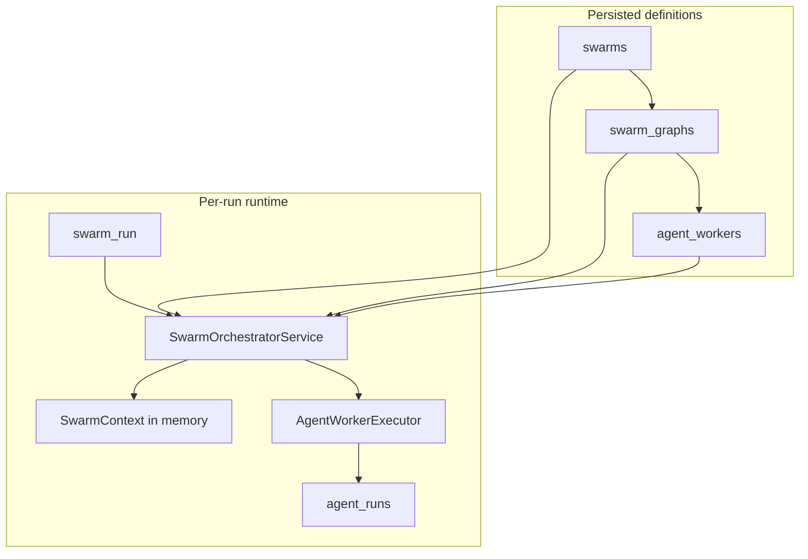
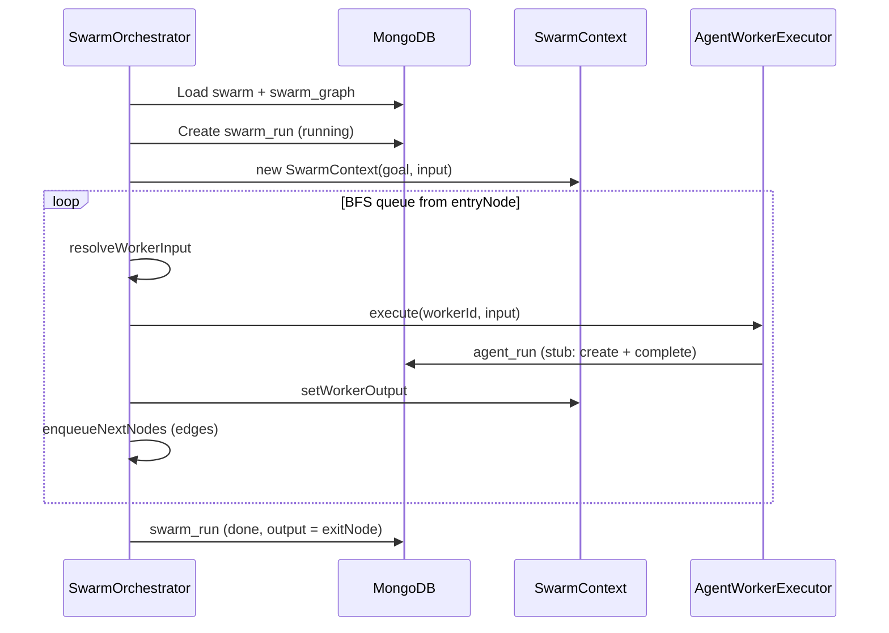

# Swarm Agents — Complete Guide

Documentation for the **`swarms`** module (`src/swarms/`): multi-agent orchestration with reusable workers, a connection graph, and per-run shared context.

---

## Table of contents

1. [Concepts](#concepts)
2. [Architecture](#architecture)
3. [MongoDB collections](#mongodb-collections)
4. [Enums and types](#enums-and-types)
5. [SwarmContext](#swarmcontext)
6. [resolveWorkerInput](#resolveworkerinput)
7. [Orchestrator (runtime)](#orchestrator-runtime)
8. [AgentWorkerExecutor](#agentworkerexecutor)
9. [Services](#services)
10. [Topologies](#topologies)
11. [Context management](#context-management)
12. [End-to-end example](#end-to-end-example)
13. [Programmatic usage](#programmatic-usage)
14. [Roadmap](#roadmap)

---

## Concepts

| Term | What it is |
|------|------------|
| **Swarm** | Definition of a multi-agent task: `goal`, declared topology, list of referenced workers. |
| **AgentWorker** | Reusable agent blueprint: model, prompts, `inputSchema` / `outputSchema` contracts. Does **not** define connections to other workers. |
| **SwarmGraph** | Directed graph for a swarm: nodes = workers, edges = data flow (`sequential`, `parallel`, `conditional`). |
| **SwarmRun** | A single execution of a swarm (user input → final output). |
| **AgentRun** | A single execution of one worker inside a `SwarmRun`. |
| **SwarmContext** | In-memory state during a run: goal, initial input, shared key/value store, outputs per worker. |

**Core idea:** a small, specialized worker connected by the graph beats one large model doing everything.

---

## Architecture



### Entity relationships

```
swarms ──1:1──► swarm_graphs ──N nodes/edges──► agent_workers
   │
   └── execution ──► swarm_runs ──1:N──► agent_runs ──► agent_workers
```

### Folder structure

```
src/swarms/
├── swarms.module.ts              # NestJS + Mongoose registration
├── schemas/
│   ├── agent-worker.schema.ts    # Agent blueprint
│   ├── agent-run.schema.ts       # Worker execution
│   ├── swarm.schema.ts           # Swarm definition
│   ├── swarm-run.schema.ts       # Swarm execution
│   └── swarm-graph.schema.ts     # Graph (nodes + edges)
├── types/
│   ├── run-status.enum.ts
│   ├── swarm-topology.enum.ts
│   ├── graph-edge-type.enum.ts
│   └── worker-node-type.enum.ts
├── context/
│   ├── swarm-context.ts          # Shared state per run
│   └── swarm-context.types.ts    # AgentWorkerRunInput, options
├── orchestrator/
│   ├── swarm-orchestrator.service.ts
│   ├── resolve-input.ts
│   ├── worker-executor.interface.ts
│   └── stub-worker-executor.service.ts
└── services/
    ├── agent-workers.service.ts
    ├── agent-runs.service.ts
    ├── swarms.service.ts
    ├── swarm-graphs.service.ts
    └── swarm-runs.service.ts
```

The module is registered in `AppModule` with REST controllers. **HTTP API reference:** [`SWARMS-API.md`](./SWARMS-API.md).  
**Agent input/output contracts:** [`SWARMS-AGENT-IO.md`](./SWARMS-AGENT-IO.md).

---

## MongoDB collections

### `agent_workers` — agent blueprint

| Field | Type | Description |
|-------|------|-------------|
| `name` | string | Human-readable id (indexed with `createdBy`). |
| `model.provider` | string | LLM provider (`openai`, `anthropic`, …). |
| `model.name` | string | Model name. |
| `model.contextWindow` | number | Context window in tokens. |
| `systemPrompt` | string | Worker instructions (first `system` message). |
| `promptMessages` | array | Optional extra `system` / `user` messages after Instructions — see [`SWARMS-AGENT-IO.md`](./SWARMS-AGENT-IO.md). |
| `inputSchema` | object | JSON Schema (or free-form contract) for expected input. |
| `outputSchema` | object | JSON Schema for structured **output** the worker should produce. |
| `compressOutput` | boolean | Legacy upstream filter; see [`SWARMS-AGENT-IO.md`](./SWARMS-AGENT-IO.md). |
| `upstreamFields` | string[] | Top-level keys from upstream when `compressOutput` is true. |
| `maxRetries` | number | Retries on failure (default `3`). |
| `timeoutMs` | number | Per-execution time ceiling (default `60000`). |
| `createdBy` | ObjectId → User | Blueprint owner. |
| `createdAt` / `updatedAt` | date | Automatic timestamps. |

**Index:** `{ createdBy: 1, name: 1 }`

**Why there is no `receives_from` / `sends_to` here:** wiring between workers lives in `swarm_graphs` so the same `AgentWorker` can be reused across swarms.

---

### `swarms` — swarm definition

| Field | Type | Description |
|-------|------|-------------|
| `name` | string | Swarm name. |
| `description` | string | Optional description. |
| `goal` | string | Original objective — **always** available in `SwarmContext` (anti context-drift). |
| `topology` | enum | `pipeline` \| `parallel` \| `hybrid` (metadata; the graph defines actual runtime). |
| `workers` | ObjectId[] | References to `agent_workers` used in the graph. |
| `createdBy` | ObjectId → User | Author. |
| `version` | string | Blueprint version (default `1.0.0`). |
| `isPublic` | boolean | Public visibility (future registry). |
| `active` | boolean | When `false`, the swarm cannot be executed. |
| `platformRunnable` | boolean | When `true`, any authenticated user may run or reference this swarm without a `swarm_hiring`. **Admin-only** field on `PATCH /admin/swarms/:id` (ignored on user `PATCH /swarms/:id`). |
| `triggers` | string[] | Routing tags (`contact_lookup`, …) for catalogs and tool routing. |
| `createdAt` / `updatedAt` | date | Timestamps. |

**Index:** `{ createdBy: 1, name: 1 }`

---

### `swarm_graphs` — topology (1 per swarm)

| Field | Type | Description |
|-------|------|-------------|
| `swarmId` | ObjectId → Swarm | **Unique** — one graph per swarm. |
| `nodes[]` | subdoc | Graph nodes — workers **or** control nodes (see below). |
| `edges[]` | subdoc | Edges between graph node ids (see below). |
| `entryNode` | string | First node to run — stable graph node id (often the Start node id or first worker id). |
| `exitNode` | string | Node whose output closes the `swarm_run` (End node id or exit worker id). |

**Node (`nodes[]`):**

| Field | Type | Description |
|-------|------|-------------|
| `id` | string | Stable React Flow / graph node id (required for control nodes and recommended for workers). |
| `kind` | enum | `worker` \| `start` \| `ifelse` \| `while` \| `scraper` \| `swarm` \| `user_approval` \| `user_input` \| `end` — resolved by `graph-index.ts` when omitted. |
| `workerId` | ObjectId | Blueprint reference when `kind` is `worker`. |
| `type` | string | Legacy / UI alias (e.g. `ifelse`, `scraper`, `swarm`). |
| `position` | `{ x, y }` | Coordinates for graph editor UI. |
| `data` | object | Control-node payload (if/else `cases`, scraper URL, sub-swarm `swarmId`, …). |

**Edge (`edges[]`):**

| Field | Type | Description |
|-------|------|-------------|
| `from` | string | Source graph node id. |
| `to` | string | Destination graph node id (receives upstream in `resolveWorkerInput`). |
| `type` | enum | `sequential` \| `parallel` \| `conditional` |
| `condition` | string \| null | For `conditional` only (see [edge conditions](#edge-conditions)). |
| `sourceHandle` | string \| null | Branch port for if/else (`case-<id>`, `else`), while (`loop`, `done`), scraper/sub-swarm (`success`, `failed`), user approval (`approve`, `reject`). |

---

### `swarm_runs` — swarm execution

| Field | Type | Description |
|-------|------|-------------|
| `swarmId` | ObjectId → Swarm | Swarm that was run. |
| `runKind` | enum | `swarm` (top-level) \| `worker_preview` \| `sub_swarm` (child run from a sub-swarm node). |
| `parentSwarmRunId` | ObjectId \| null | Parent `swarm_run` when `runKind === sub_swarm`. |
| `parentNodeId` | string \| null | Sub-swarm graph node id in the parent that invoked this run. |
| `depth` | number | Nesting depth (`0` = root, `1` = first sub-swarm, …). |
| `triggeredBy` | ObjectId → User | User who started the run. |
| `input` | object | Caller’s initial payload. |
| `output` | object \| null | Final result (`exitNode` output). |
| `agentRuns` | ObjectId[] | Generated `agent_runs` ids. |
| `status` | enum | `idle` \| `running` \| `awaiting_approval` \| `failed` \| `done` |
| `durationMs` | number | Layered graph duration: sum of per-wave max node times (parallel nodes count once per wave). |
| `promptTokens` | number | Sum of input tokens across all `agent_runs`. |
| `completionTokens` | number | Sum of output tokens across all `agent_runs`. |
| `totalTokens` | number | `promptTokens + completionTokens`. |
| `costUsd` | number \| null | Estimated OpenAI list-price USD for `openai_direct` runs only; `null` if not applicable or an unknown model id. |
| `scrapeCostUsd` | number | Browser scraping cost ($0.09/hr on summed browser time; see `scrapeUsage`). |
| `totalCostUsd` | number | `costUsd` (0 when unknown) + `scrapeCostUsd`. |
| `usageByModel` | array | Per provider+model breakdown (`provider`, `model`, `promptTokens`, `completionTokens`, `totalTokens`, `costUsd`, `agentRunCount`). |
| `scrapeUsage` | object | `requestCount`, `browserDurationMs`, `costUsd`, `requests[]` (`scrapeRequestId`, `url`, `latencyMs`, `costUsd`, `status`). |
| `failureReason` | string | Message when `status === failed`. |
| `createdAt` / `updatedAt` | date | Timestamps. |

**Index:** `{ swarmId: 1, createdAt: -1 }`

---

### `agent_runs` — worker execution

| Field | Type | Description |
|-------|------|-------------|
| `workerId` | ObjectId → AgentWorker | Worker that ran. |
| `swarmRunId` | ObjectId → SwarmRun | Parent run. |
| `messages[]` | subdoc | LLM history (`system` \| `user` \| `assistant`). |
| `input` | object | Resolved payload (serialized `AgentWorkerRunInput`). |
| `output` | object \| null | Worker structured output. |
| `status` | enum | `idle` \| `running` \| `awaiting_approval` \| `failed` \| `done` |
| `durationMs` | number | Execution duration. |
| `attempt` | number | Attempt number (reserved for explicit DB retries). |
| `createdAt` / `updatedAt` | date | Timestamps. |

**Index:** `{ swarmRunId: 1, workerId: 1 }`

**Message (`messages[]`):**

| Field | Type |
|-------|------|
| `role` | `system` \| `user` \| `assistant` |
| `content` | string |
| `tokensUsed` | number |
| `timestamp` | date |

---

## Enums and types

### `RunStatus` (`types/run-status.enum.ts`)

Used in `swarm_runs` and `agent_runs`.

| Value | Meaning |
|-------|---------|
| `idle` | Created, not started. |
| `running` | In progress. |
| `awaiting_approval` | Paused at a user-approval node. |
| `failed` | Finished with error. |
| `done` | Completed successfully. |

### `SwarmTopology` (`types/swarm-topology.enum.ts`)

Metadata on `swarms.topology` — documents design intent.

| Value | Pattern |
|-------|---------|
| `pipeline` | Series: A → B → C |
| `parallel` | Concurrent branches into a synthesizer |
| `hybrid` | Mix (most common in production) |

### `GraphEdgeType` (`types/graph-edge-type.enum.ts`)

Controls how the orchestrator enqueues the next node.

| Value | Runtime behavior |
|-------|------------------|
| `sequential` | Enqueue `edge.to` after the current node completes. |
| `parallel` | Enqueue **all** outgoing `parallel` edges from the current node. |
| `conditional` | Enqueue `edge.to` only if `condition` evaluates to true. |

### `WorkerNodeType` (`types/worker-node-type.enum.ts`)

Semantic node classification (UI / analytics).

| Value | Typical use |
|-------|-------------|
| `orchestrator` | Router or coordinator. |
| `worker` | Standard specialized agent. |
| `synthesizer` | Merges parallel branch outputs. |

### `AgentWorkerRunInput` (`context/swarm-context.types.ts`)

Payload each worker receives at execution time:

```typescript
interface AgentWorkerRunInput {
  goal: string;           // Swarm goal — for {{goal}} substitution
  systemPrompt: string;   // From agent_worker.systemPrompt (Instructions)
  upstream: Record<string, unknown>[];  // Graph predecessor outputs
  shared: Record<string, unknown>;    // SwarmContext shared map — for {{shared.*}}
  runInput: Record<string, unknown>;  // Caller run input — for {{runInput.*}}
  promptMessages?: Array<{ role: 'system' | 'user'; content: string }>;  // Extra messages
}
```

At inference time, `buildWorkerChatMessages` sends `systemPrompt` + `promptMessages` only. See [`SWARMS-AGENT-IO.md`](./SWARMS-AGENT-IO.md#prompt-assembly-runtime).

---

## SwarmContext

Class in `context/swarm-context.ts`. **One instance per `SwarmRun`**, lives in memory only during `runSwarm`.

### What it stores

| Store | API | Purpose |
|-------|-----|---------|
| Goal + run input | `goal`, `runInput` (readonly) | Always visible to every worker. |
| Shared | `setShared(key, value)`, `getSharedValue`, `getShared()` | Data to share **without** going through the graph (e.g. `userId`, global flags). |
| Worker outputs | `setWorkerOutput`, `getWorkerOutput`, `getAllWorkerOutputs` | Result of each executed node (key = `workerId.toString()`). |

### When to use `shared` vs `upstream`

| Mechanism | When |
|-----------|------|
| **upstream** | A predecessor’s output in the graph must feed the next node (explicit flow). |
| **shared** | Multiple workers need the same data that does not come from an edge (config, user context, global run state). |

### Example

```typescript
const context = new SwarmContext({
  goal: swarm.goal,
  swarmRunId: swarmRun._id,
  runInput: { topic: 'NestJS swarms' },
});

context.setShared('locale', 'en');
// After worker A runs:
context.setWorkerOutput(workerAId, { decision: 'approve', confidence: 0.9 });
```

---

## resolveWorkerInput

Pure function in `orchestrator/resolve-input.ts`. **The most important piece of wiring.**

### Algorithm

1. Find all `edges` where `edge.to === workerId`.
2. For each edge, read `context.getWorkerOutput(edge.from)`.
3. Filter null outputs (predecessor not run yet — should not happen on a valid graph).
4. If `worker.compressOutput === true`, wrap each upstream output with selected top-level keys (`upstreamFields` or defaults). See [`SWARMS-AGENT-IO.md`](./SWARMS-AGENT-IO.md).
5. Return `AgentWorkerRunInput` with `goal`, `systemPrompt`, `upstream`, `shared`, `runInput` (for `{{…}}` substitution).

`runInput` is passed through **as-is** from the caller (not filtered by `compressOutput` today).

### Upstream compression (legacy)

Reduces tokens between nodes in long pipelines:

```
Worker A → 400 tokens of analysis
    ↓ compressOutput: true
Worker B receives ~80 tokens in upstream[0].summary
```

---

## Orchestrator (runtime)

`SwarmOrchestratorService.runSwarm(swarmId, options)` in `orchestrator/swarm-orchestrator.service.ts`.

### Options

```typescript
interface RunSwarmOptions {
  userId: string;              // Who triggered the run (→ swarm_runs.triggeredBy)
  input?: Record<string, unknown>;  // → SwarmContext.runInput + swarm_runs.input
  maxNodeVisits?: number;      // Anti-loop (default 50)
}
```

### Step-by-step flow



1. Load `swarm` and `swarm_graph`.
2. Create `swarm_run` with `status: running`.
3. Instantiate `SwarmContext`.
4. BFS queue from `graph.entryNode`.
5. For each node:
   - Increment visit count; if over `maxNodeVisits` → loop error.
   - `resolveWorkerInput` → `runWorkerWithRetries` → store output in context.
   - Process outgoing edges (`enqueueNextNodes`).
6. Take `graph.exitNode` output and mark `swarm_run` as `done`.
7. On error: `swarm_run` → `failed` + `failureReason`, rethrow.

### Retries and timeout

- **Retries:** up to `worker.maxRetries` inclusive (attempts `0..maxRetries`).
- **Timeout:** `worker.timeoutMs`; on expiry → error → retry.

### Edge conditions

Provisional evaluation in `evaluateCondition` (replace with a safe expression engine in production):

| `condition` | Result |
|-------------|--------|
| `null` / empty | `true` |
| `"always"` | `true` |
| `"output.field"` | `true` if `output.field != null` |
| any other string | `Boolean(output[condition])` |

### Fork–join (diamond) graphs

When a worker has **multiple incoming edges**, the orchestrator waits until **every** predecessor has finished (success or recorded branch failure) before running it. When several workers are ready in the same wave, they run **concurrently** (`Promise.all`).

Example (your workspace layout):

```
Entrada → agent + agent 2 (parallel wave) → Salida (join)
```

- Edges may stay `sequential`; fork/join follows **graph shape**, not only `parallel` edge type.
- A middle branch that exhausts retries stores `{ failed: true, error }` in context and still counts toward the join so **Salida** can run with partial `upstream`.
- **Entrada** or **Salida** failure still fails the whole `swarm_run`.

Outgoing `parallel` edges are optional documentation; runtime fork is driven by multiple ready nodes after a shared predecessor completes.

### If/else control nodes

Graph nodes with `kind: "ifelse"` (or `type: "ifelse"`) branch the flow without calling an LLM:

| Field | Description |
|-------|-------------|
| `data.cases[]` | `{ id, name?, condition, useCode? }` — first matching condition wins. |
| `edges[].sourceHandle` | `case-<caseId>` or `else` — same rule as platform `caseHandleId()`: if `caseId` already starts with `case-`, the handle is that id; otherwise `case-${caseId}`. Legacy graphs may still use `case-case-…` wires; the orchestrator tolerates both via `ifElseBranchHandlesMatch`. |

**Simple vs Code (platform UI):** both modes store the final string in `cases[].condition`. `useCode` is editor metadata only; the orchestrator always evaluates `condition` via `evaluateSwarmExpression`. Code mode accepts the same tokens as Simple (e.g. `runInput.website`, `summary`, `output.field`).

Prefer **upstream** from the agent wired into the if/else (same tokens as agent prompts):

| Pattern | When |
|---------|------|
| `upstream.result == "yes"` | Single predecessor |
| `upstream.<slug>.<field>` | Multiple predecessors (slug = worker name) |
| `output.<field>` | Alias of primary upstream |
| `runInput.*` / `shared.*` | Optional run / shared state |

Supports comparisons (`==`, `!=`, `>`, …) and `{{upstream.field}}` (mustache stripped). Empty conditions are skipped; if none match, the `else` branch runs. Downstream agents receive the **passthrough** output from the worker immediately before the branch.

**Code mode examples**

```text
runInput.website == "https://acme.com"
runInput.summary.length > 0
summary == "yes"
runInput.tier != "free"
runInput.tags.length >= 1 && runInput.primary_icp != ""
goal == "research competitors"
!runInput.summary
```

Supports JS-like syntax: property paths, `.length` on strings/arrays, `[index]` on arrays, `===` / `!==`, `&&`, `||`, `!`, and parentheses. Not a full JS engine (no function calls, methods, or arbitrary expressions).

Incomplete expressions (operator with no right-hand side, e.g. `runInput.website ==`) evaluate to **false** and fall through to the next case or **Else**.

**Canvas wiring:** connect each case port and **Else** to downstream nodes. Edge `sourceHandle` must be `case-<caseId>` (same id as in `data.cases[].id`, with the `case-` prefix) or `else`. Re-draw edges from the branch handles after changing cases (the editor removes wires when a case is deleted). On save, the platform dedupes legacy duplicate wires (`case-case-*` + `case-*`) and validates that each case with a condition has a wire from its port.

**Legacy / single-wire graphs:** if the canvas has only one downstream wire from an if/else node and the run takes a case branch (not Else), the orchestrator treats that wire as the active branch even when `sourceHandle` is missing or mismatched. Else with a single If-only wire does **not** run downstream (no implicit routing).

**Scheduler:** after a branch node completes, downstream targets are activated immediately (`branchActivated`) and `refreshSkippedNodes` is skipped for that wave so join nodes are not frozen as `skipped` before the active branch runs.

**Quick test graph**

```text
Start → Agent A → If/else ──case-<id>──→ Agent B → Salida
                      └──else──────────→ Agent C → Salida
```

1. Wire **Agent A** into the if/else target port.
2. In the if/else panel, set condition e.g. `result == "yes"` (use chips from upstream `outputSchema` keys).
3. Connect the **first case** handle to **Agent B**, **Else** to **Agent C**, both to **Salida**.
4. Run from Test Swarm; SSE emits `node_start` / `node_done` with `nodeKind: ifelse` and `output.branchHandle`. Inactive branches emit `node_skipped` with `reason: branch_pruned`.

If the active branch has no path to Salida, the run still finishes (`done`) with the if/else output (same as user-approval branch end).

### While control nodes

Graph nodes with `kind: "while"` (or `type: "while"`) repeat a branch while a condition stays truthy. No LLM call at the node itself — only expression evaluation (same engine as if/else).

| Field | Description |
|-------|-------------|
| `data.condition` | Expression evaluated **before each iteration**. Loop continues while truthy. |
| `data.useCode` | Editor metadata only (Simple vs Code on the platform). Backend always uses `condition`. |
| `data.maxIterations` | Safety cap (default **50**, max **500**). Exceeded → run fails with a clear error. |
| `edges[].sourceHandle` | `loop` (body to repeat) or `done` (exit when condition is false). |

**Simple vs Code (platform UI):** both modes persist the final string in `data.condition`. Prefer upstream tokens from the agent wired into the While node (same table as [If/else](#ifelse-control-nodes)). Empty `condition` evaluates to **false** → **Done** branch.

**Runtime behavior**

1. On each visit, increment the iteration counter and evaluate `condition`.
2. If **true** → activate downstream on `loop`, **do not** mark the While node completed (so the body can flow back).
3. If **false** → activate downstream on `done`, mark the While node completed.
4. On iteration **> 1**, reset completion state and outputs for all nodes in the **loop body** (reachable from `loop` until the back-edge into the While target) so workers run again.
5. Inactive branch (`done` while looping, or `loop` after exit) is pruned like if/else (`node_skipped`, `reason: branch_pruned`).

**Loop body wiring:** the last node in the body must have an edge back to the While node’s **target** port (left handle). The orchestrator does not infer implicit back-edges.

**Node output** (`node_done`):

| Field | Description |
|-------|-------------|
| `kind` | `"while"` |
| `branchHandle` | `"loop"` or `"done"` |
| `iteration` | 1-based index for this evaluation |
| `conditionResult` | Boolean result of `condition` |
| `matchedCondition` | Stored condition string (when non-empty) |
| `passthrough` | Worker output from the predecessor immediately before the While (for downstream agents on the active branch) |

**Legacy / single-wire graphs:** if the canvas has only one downstream wire from a While node, the orchestrator treats it as the **loop** branch when `sourceHandle` is missing (same pattern as scraper success / if/else first case).

**Quick test graph**

```text
Start → Agent A → While ──loop──→ Agent B ──┐
                      └──done──→ End         │
                      ↑______________________|
```

1. Wire **Agent A** into the While target port.
2. Set condition e.g. `runInput.attempts < 3` or a Code expression using upstream fields (update `shared.attempts` in **Agent B** each loop if needed).
3. Connect **Loop** → **Agent B**, back-edge **Agent B** → While target, **Done** → **End**.
4. Run from Test Swarm; SSE emits `node_start` / `node_done` with `nodeKind: while` and `output.iteration` on each pass.

If **Done** has no path to Salida/End, the run can still finish with the While output when that branch ends (same as if/else).

### User approval control nodes

Graph nodes with `kind: "user_approval"` pause the swarm run until a human approves or rejects. The run status becomes `awaiting_approval` and a checkpoint is stored on `swarm_runs`.

| Field | Description |
|-------|-------------|
| `data.name` | Inbox / UI label (default: `User approval`). |
| `data.message` | Prompt shown to the assignee. |
| `data.assignee` | `runner` (default), `owner` (swarm creator), or a user Mongo id. |
| `edges[].sourceHandle` | `approve` or `reject` — must match canvas handles. |

**Flow**

1. Orchestrator reaches the node → creates `swarm_run_approvals` (pending) → saves checkpoint → stops (not failed).
2. Assignee calls `POST /api/v1/swarm-run-approvals/:id/decide` with `{ "decision": "approve" \| "reject", "comment"?: string }`.
3. Orchestrator resumes from checkpoint, records branch output (`kind: "user_approval"`), and continues the graph.

**HTTP**

| Method | Path | Description |
|--------|------|-------------|
| `GET` | `/swarm-run-approvals/pending` | Inbox for current user |
| `GET` | `/swarm-run-approvals/:id` | Approval detail (assignee or requester) |
| `POST` | `/swarm-run-approvals/:id/decide` | Decide + resume run |
| `GET` | `/swarm-runs/:id/pending-approval` | Pending gate for a run (if any) |

Sync run / SSE when paused: response includes `paused: true` and `approval`; SSE emits `approval_required` instead of `swarm_done`.

Downstream workers receive **passthrough** from the predecessor (same as if/else), plus `decision`, `approvalId`, and `comment` on the approval output when relevant.

If the chosen branch (`approve` or `reject`) is **not wired** to the exit node, the run still completes successfully (`status: done`) with the approval node output as `output` (no 500 deadlock). Wire the branch to **Salida** when downstream work should run after approve/reject.

**Canvas wiring:** connect only the handle you need (`Approve` or `Reject`). If both handles are wired to the same downstream node, the orchestrator treats them as **OR** (only the active branch must match). Do not connect from the node body — use the labeled ports so `sourceHandle` is saved as `approve` / `reject`.

### Sub-swarm control nodes

Graph nodes with `kind: "swarm"` run another saved swarm inline and branch like the scraper node.

| Field | Description |
|-------|-------------|
| `data.label` | Optional display label in the editor. |
| `data.swarmId` | Mongo id of the child swarm (required on save). |
| `data.passShared` | When `true`, copy parent `SwarmContext.shared` into the child run input. |
| `data.inputFields[]` | Optional mapping rows: `{ key, source, valuePath?, staticValue? }` where `source` is `upstream` \| `runInput` \| `shared` \| `static` \| `field`. |
| `edges[].sourceHandle` | `success` or `failed` — must match canvas branch ports. |

**Child run input**

1. When `passShared` is `true`, parent shared state is merged in.
2. When `inputFields` is empty, upstream payload from the wire into the sub-swarm node is passed through (same as default scraper/agent passthrough).
3. When `inputFields` is set, each row resolves via `evaluateSwarmExpression` and sets `childInput[key]`.

**Runtime**

- Creates a nested `swarm_run` with `runKind: sub_swarm`, `parentSwarmRunId`, `parentNodeId`, and `depth`.
- On child completion (`status: done` with output), the parent records `kind: "swarm"` output with `branchHandle: success` and merges child end output for downstream nodes on the success wire.
- On child failure, `branchHandle: failed` and the failed branch activates.
- SSE: `node_start` / `node_done` with `nodeKind: swarm`.

**Access to reference a child swarm** (validated on `PUT /swarms/:id/graph`):

- Owner of the child swarm, **or**
- Active `swarm_hiring` for that swarm, **or**
- Child swarm has `platformRunnable: true`.

**Graph validation** (`validate-swarm-graph-references.ts`):

| Rule | Error when violated |
|------|---------------------|
| `data.swarmId` required, valid ObjectId | `400` on graph save |
| Cannot reference self | `400` |
| No cycles in the reference graph | `400` Circular sub-swarm reference |
| Max nesting depth **3** (root + 3 levels of references) | `400` |
| Referenced swarms must not contain `user_approval` nodes | `400` — use `user_input` in the child and parent bubble instead |
| Referenced swarm must have a saved graph | `400` |

**`user_input` bubble (nested runs)**

Sub-swarm graphs may use `user_input` nodes, but **not** `user_approval`. When a nested run hits `user_input`, the orchestrator **bubbles** the pause to the **root** parent run:

- Root `swarm_run` stores a checkpoint with `pendingSubSwarm` frames (supports A → B → C nesting).
- The pause is recorded on the **parent** `swarmRunId`, not the child.
- After the human supplies input at the root, the orchestrator resumes the child at the paused `user_input` node and continues the nested stack.

Platform editor: palette **Sub-swarm**, config panel with swarm picker + input mapping — see [`SWARMS-WORKSPACE.md`](./SWARMS-WORKSPACE.md#sub-swarm-node-platform-editor).

**Swarm tools (LLM function calling):** workers list child swarm ids in `swarmTools` (each exposed as `swarm_<objectId>`). Use `run_swarm` in `agentTools` only when the model must pick any accessible swarm by id and `swarmTools` is empty — when sub-swarms are listed, `run_swarm` is omitted at runtime. Same sub-swarm execution path and nesting limits as graph sub-swarm nodes; input from model tool args. [`TOOLS.md`](./TOOLS.md#swarm-tools-swarmtools), [`TOOLS.md` — run_swarm vs swarmTools](./TOOLS.md#run_swarm-vs-swarmtools).

**Example node (API / graph JSON)**

```json
{
  "id": "swarm-node-research",
  "kind": "swarm",
  "position": { "x": 320, "y": 120 },
  "data": {
    "label": "Company research",
    "swarmId": "674abc1234567890abcdef01",
    "passShared": false,
    "inputFields": [
      { "key": "message", "source": "upstream", "valuePath": "output.topic" }
    ]
  }
}
```

Wire `sourceHandle: "success"` or `"failed"` to downstream nodes (same pattern as scraper).

---

## AgentWorkerExecutor

Plug-in interface in `orchestrator/worker-executor.interface.ts`.

```typescript
interface AgentWorkerExecutor {
  execute(
    workerId: Types.ObjectId,
    swarmRunId: Types.ObjectId,
    input: AgentWorkerRunInput,
  ): Promise<{ output: Record<string, unknown>; agentRunId: Types.ObjectId }>;
}
```

### NestJS registration

Injection token: `AGENT_WORKER_EXECUTOR`.

By default, `SwarmsModule` binds `StubWorkerExecutorService`:

- Creates `agent_run` in `running` state.
- Returns stub output `{ workerId, stub: true, upstreamCount, goal }`.
- Marks `agent_run` as `done`.

### Connecting a real LLM

1. Create `OpenAiWorkerExecutorService` (or similar) implementing `AgentWorkerExecutor`.
2. Call the provider with `input.goal`, `input.systemPrompt`, `input.upstream`, etc.
3. Persist `messages[]` and `tokensUsed` on `agent_runs`.
4. In `swarms.module.ts`:

```typescript
{
  provide: AGENT_WORKER_EXECUTOR,
  useClass: OpenAiWorkerExecutorService, // instead of useExisting: Stub...
}
```

---

## Services

| Service | Responsibility |
|---------|----------------|
| `AgentWorkersService` | `findById`, `findByIds` (map), `create` |
| `AgentRunsService` | `createPending`, `complete`, `markFailed` |
| `SwarmsService` | `findById` |
| `SwarmGraphsService` | `findBySwarmId` |
| `SwarmRunsService` | `createRunning`, `appendAgentRun`, `finish` |
| `SwarmOrchestratorService` | `runSwarm` — **runtime entry point** |

### Module exports

`SwarmsModule` exports: `AgentWorkersService`, `SwarmsService`, `SwarmGraphsService`, `SwarmRunsService`, `SwarmOrchestratorService`.

Use from another module:

```typescript
@Module({
  imports: [SwarmsModule],
})
export class MyFeatureModule {}
```

---

## Topologies

### Series (pipeline)

```
A → B → C → D
```

Edges: all `sequential`. `entryNode = A`, `exitNode = D`.

### Parallel

```
        ┌→ A1 ─┐
Input → ├→ A2 ─┤ → Synthesizer
        └→ A3 ─┘
```

From the router node: multiple `parallel` edges to A1, A2, A3. Then `sequential` edges to the synthesizer.

### Hybrid

```
Router
  ├→ [A1 + A2 parallel] → Merge
  └→ A3 (conditional)
         ↓
       Final
```

Combines `parallel`, `sequential`, and `conditional` in one graph.

### Recommended swarm size

| Agents | When |
|--------|------|
| 2–3 | Generator + critic + synthesizer |
| 4–6 | Independent parallel stages |
| 7–15 | Distinct sub-domains |
| 15+ | Only with mature infrastructure |

Typical sweet spot: **3–7 workers**.

---

## Context management

### Three patterns (design)

| Pattern | Description | Current implementation |
|---------|-------------|------------------------|
| **Isolated** | Only immediate input (graph upstream). | Default via `upstream` in `resolveWorkerInput`. |
| **Accumulated** | Full history in every prompt. | Not automatic — avoids token explosion. |
| **Selective** | Orchestrator chooses what passes. | `compressOutput` / planned `inputPick` + `shared` + graph edges ([`SWARMS-AGENT-IO.md`](./SWARMS-AGENT-IO.md)). |

### Always available for `{{…}}` (via `AgentWorkerRunInput`)

- `goal` — swarm objective (`{{goal}}`).
- `systemPrompt` — Instructions (first `system` message).
- `runInput` — caller’s initial payload (`{{runInput.*}}`).
- `shared` — cross-worker run state (`{{shared.*}}`).

Include tokens in Instructions or `promptMessages` only when the model should read that slice.

### Pitfalls to avoid

| Pitfall | Mitigation |
|---------|------------|
| Filler agents (format-only) | Use functions, not workers. |
| Context drift | `goal` on every input. |
| Infinite loops | `maxNodeVisits` in `runSwarm`. |
| Workers with no decisions | Each worker should emit meaningful structured output. |

---

## End-to-end example

Two-worker pipeline: **Analyzer** → **Writer**.

### 1. Create workers (MongoDB / service)

```javascript
// analyzerId, writerId — ObjectIds returned by create()
```

### 2. Create swarm

```javascript
{
  name: "Blog pipeline",
  goal: "Write a clear technical post about the user's topic",
  topology: "pipeline",
  workers: [analyzerId, writerId],
  createdBy: userId
}
```

### 3. Create swarm_graph

```javascript
{
  swarmId,
  nodes: [
    { workerId: analyzerId, type: "worker", positionX: 0, positionY: 0 },
    { workerId: writerId, type: "worker", positionX: 200, positionY: 0 }
  ],
  edges: [
    { from: analyzerId, to: writerId, type: "sequential", condition: null }
  ],
  entryNode: analyzerId,
  exitNode: writerId
}
```

### 4. Run

```typescript
const result = await swarmOrchestrator.runSwarm(swarmId, {
  userId: req.user.sub,
  input: { topic: 'Swarm agents in NestJS' },
});
// result.output → writer output (exitNode)
// result.swarmRun → updated swarm_runs document
```

---

## Programmatic usage

From a NestJS service with `SwarmsModule` imported:

```typescript
constructor(
  private readonly swarmOrchestrator: SwarmOrchestratorService,
) {}

async run(userId: string, swarmId: string, input: Record<string, unknown>) {
  return this.swarmOrchestrator.runSwarm(swarmId, { userId, input });
}
```

Writing to `SwarmContext.shared` during execution requires extending the orchestrator or a post-worker hook (today only the executor/orchestrator have access; workers receive `shared` as read-only in the input).

---

## Roadmap

| Item | Status |
|------|--------|
| HTTP: CRUD workers, swarms, graphs | Done — see [`SWARMS-API.md`](./SWARMS-API.md) |
| Workspace editor contract | Done — see [`SWARMS-WORKSPACE.md`](./SWARMS-WORKSPACE.md) |
| `GET /swarms/:id/workspace` | Done |
| `POST /swarms/:id/run` | Done |
| `POST /agent-workers/:id/run` (worker preview) | Done |
| `swarmRun.runKind` (`swarm` \| `worker_preview` \| `sub_swarm`) | Done |
| Sub-swarm nodes + nesting validation (depth 3) | Done |
| `platformRunnable` (admin) + access without hiring | Done |
| Nested `user_input` bubble to root parent run | Done |
| DTOs + `class-validator` | Done |
| Real LLM executor + `messages` / tokens | Done — [`INFERENCE.md`](./INFERENCE.md) |
| SSE `POST /swarms/:id/run/stream` (test panel) | Done — [`INFERENCE.md#sse-swarm-run-stream`](./INFERENCE.md#sse-swarm-run-stream) |
| `Promise.all` for ready waves (fork) + join on multiple incoming edges | Done |
| Safe condition engine (no `eval`) | Pending |
| Public blueprint registry (`isPublic`) | Pending |
| Runtime `inputSchema` / `outputSchema` validation | Pending |

---

## Repo references

| File | Contents |
|------|----------|
| `src/swarms/swarms.module.ts` | Module wiring |
| `src/swarms/orchestrator/swarm-orchestrator.service.ts` | `runSwarm` algorithm |
| `src/swarms/orchestrator/resolve-input.ts` | Input resolution |
| `src/swarms/context/swarm-context.ts` | Shared context |
| [`SWARMS-API.md`](./SWARMS-API.md) | HTTP routes, DTOs, examples |
| [`MODULES.md`](./MODULES.md) | Adding modules to the app |
| [`GUARDS.md`](./GUARDS.md) | Auth guards |
